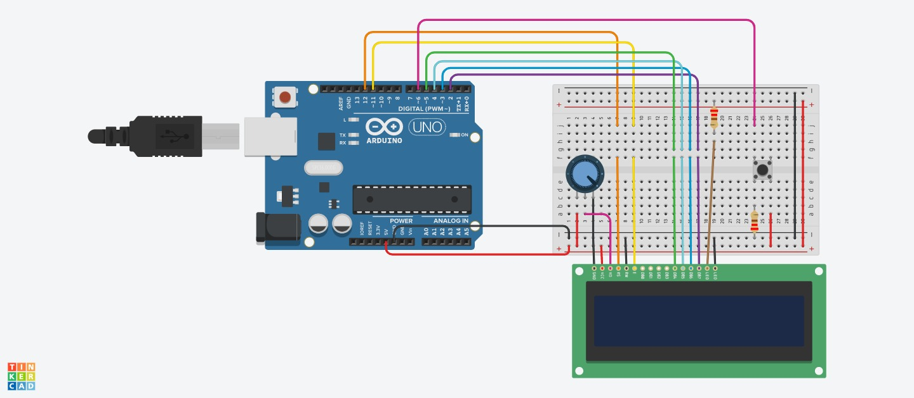

## Smart signage project
> Dutch: slimme bewegwijzering

> This the documentation for a prototype of a school project. This is developed after a literature study researching cycle parking habits and how to steer them under students in Groningen. The purpose of this prototype is mainly proof of concept.

### Setup
1. Apply the following circuit setup on to a ESP32 (should be roughly the same as this Arduino schematic):


2. Set the `ssid` and `pass` values inside the code.

3. Upload the [main.ino](./main.ino) onto the ESP32.

4. After the Wi-Fi has connected you should see a IP in your output console, remember this IP.

5. Now perform a test by flipping the signage: 
> Curl example: 
`curl -X POST http://<IP>:80/flip`


# Endpoints
## **flip**

`GET` flip/

Switch letters on signage board to other option
### Sample request
`curl -X POST http://localhost:80/flip`
### Sample response
```
{
    "value": true
}
```
### Response definitions
Response item | Description	Data | type
---------------|---------------|---------------
value | returns whether signange was switched succesfully | boolean


